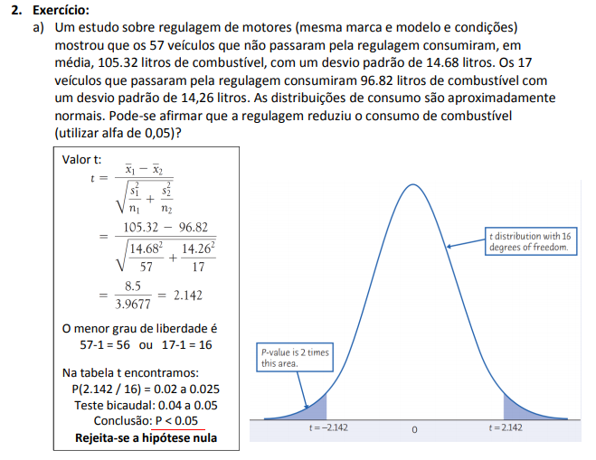

Um estudo sobre regulagem de motores (mesma marca e modelo e condições) mostrou que os **57 veículos** que não passaram pela regulagem consumiram, em média, 105.32 litros de combustível, com um desvio padrão de **14.68 litros**. Os **17 veículos** que passaram pela regulagem consumiram **96.82** litros de combustível com um desvio padrão de **14,26 litros**. As distribuições de consumo são aproximadamente normais.

Pode-se afirmar que a regulagem reduziu o consumo de combustível (utilizar alfa de 0.05)?

```{r}
n1 <- 57
n1.m <- 105.32
n1.sd <-14.68

n2 <- 17
n2.m <- 96.82
n2.sd <-14.26

t <- (n1.m - n2.m) / sqrt(n1.sd^2/n1 + n2.sd^2/n2)

interval <- qt(c(.05), df=16, lower.tail = TRUE)

paste ("H0: Média X1 não é menor do que X2")
paste ("H1: Média X1     é menor do que X2") # Falso 
paste ("Conc.: Negamos a hipótese em razão de t=", round(t[1],3),"estar fora do intevalo de", round(interval[1],3),"e",round(interval[2],3) )
```




```{r echo=FALSE}
set.seed(97)
teste_3<-data.frame(valor = c(rnorm(n=30, 22, sd=.8), 
                              rnorm(n=30, 23, .7)),
                    popul = c(rep('A',30), 
                              rep('B',30)))
boxplot(valor ~ popul, teste_3)

med_A <- mean(teste_3$valor[teste_3$popul=="A"])
med_B <- mean(teste_3$valor[teste_3$popul=="B"])

# verificando se uma normalidade
shap_A <- shapiro.test(teste_3$valor[teste_3$popul=="A"])
shap_B <- shapiro.test(teste_3$valor[teste_3$popul=="B"])

# verificando se uma normalidade
qqnorm(exp(teste_3$valor[teste_3$popul=='A']))
qqline(exp(teste_3$valor[teste_3$popul=='A']))

# verificando se uma normalidade
qqnorm(log(teste_3$valor[teste_3$popul=='B']))
qqline(log(teste_3$valor[teste_3$popul=='B']))

require(car)
# verificando a igualdade sobre a variancia
car::leveneTest(valor ~ popul , teste_3)

# gerando um t de t-student (TST) para a hipotese (generica)
t.test(valor ~ popul, teste_3, var.equal=TRUE, alternative="two.sided")
paste("rejeito a hipotese nula, logo as medias são diferentes")

#
```

Um estudo quer verificar o efeito de uma dieta no crescimento (em 10 kilogramas) de carneiros. Para isso, ele mensurou a massa de 30 carneiros em dois tempos: t1 e t2. No tempo t1 os carneiros não iniciaram a dieta e no tempo t2 depois que iniciaram a dieta.
```{r}
library(tidyr)
library(dplyr)

set.seed(42)
t1<-rnorm(30,20,2)
t2<- t1+rnorm(30,1,0.3)
teste_4_wide <- data.frame( t1=t1, t2=t2, n=1:30)

teste_4_long<-teste_4_wide %>% gather(key=tempo, value=valores, -n) 


boxplot(valores ~ tempo, teste_4_long,
        main="Massa dos carneiros nos tempos t1 e t2", 
        ylab="Massa (*10 kg)")

write.csv(teste_4_long, "teste_4_long.csv")

ggplot(teste_4_long, 
       aes(x=as.factor(tempo),y=valores, group=n))+
  geom_point()+geom_smooth(method='lm', se=F)+theme_classic()

ggplot(teste_4_long, 
       aes(x=as.factor(tempo),y=valores))+
  geom_point(aes(group=n))+
  geom_smooth(aes(group=n),method='lm', se=F)+
  geom_boxplot(aes(fill=tempo),alpha=0.2)+
  theme_bw()

t.test(valores ~ tempo, teste_4_long)
t.test(valores ~ tempo, teste_4_long, paired=T)

```

1. Num estudo comparativo do tempo médio de adaptação, uma amostra aleatória, de 50 homens e 50 mulheres de um grande complexo industrial, produziu os seguintes resultados:
Que conclusões você poderia tirar para a população de homens e mulheres dessa indústria? (Indique as suposições feitas para resolver o problema.)


```{r}
library(tidyr)
library(dplyr)

set.seed(42)
t1<-rnorm(50,3.2,0.8)
t2<- t1+rnorm(50,3.7,0.9)
teste_4_wide <- data.frame( t1=t1, t2=t2, n=1:30)

teste_4_long<-teste_4_wide %>% gather(key=tempo, value=valores, -n) 

```


```{r}
library(tidyr)
library(dplyr)

set.seed(42)
t1<-rnorm(50,3.2,0.8)
t2<- t1+rnorm(50,3.7,0.9)
teste_4_wide <- data.frame( t1=t1, t2=t2, n=1:30)

teste_4_long<-teste_4_wide %>% gather(key=tempo, value=valores, -n) 

```

1. Os produtores de um programa de televisão pretendem modificá-lo se for assistido regularmente por menos de um quarto dos possuidores de televisão. Uma pesquisa encomendada a uma empresa especializada mostrou que, de 400 famílias entrevistadas, 80 assistem ao programa regularmente. Com base nos dados, qual deve ser a decisão dos produtores?

```{r}
400
80 
prop.test(x = 80, p = 0.25, conf.level = 0.05, n = 400 )
```